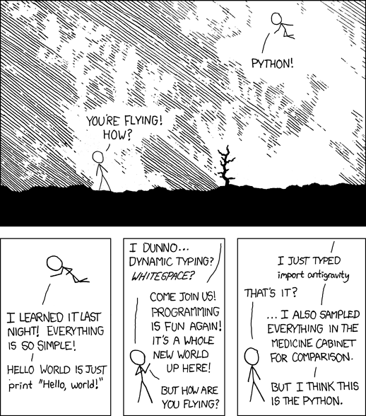

# Python Científico
## de la ecuación al programa

--- 

## Admin IB
### Python Científico: de la ecuación al programa

- Inscripción
	- grado: `Siu Guaraní: Autogestión`
	- posgrado: formulario recibido email
	- vocacionales: formulario por email
- La inscripción cierra pronto 
- 64 horas de clase: 4x16

---

## Admin Cátedra
	Mariano Gómez Berisso
	Willy Pregliasco
- Clases presenciales
- Aprobación
- Dinámica: 4 horas de clase-taller
- Horarios
	- Martes de 14:00 a 18:00 
	- Jueves de 8:30 a 12:30

--- 
### Admin Clases

| contexto | URL                                        |
| -------- | ------------------------------------------ |
| local    | `http://python.local`                      |
| online   | `https://wpregliasco.github.io/python-sci` |

* Notas de clase
* Pantallas de los docentes
* Jupyter server
	* TPs

---

# `Python?`

[xkcd](https://xkcd.com/)

---
## Monthy Python

[Ministry of Silly Walks](https://www.youtube.com/watch?v=-Fx0qJNhy9U)

---

## Python

Guido van Rossum - Navidad de 1989

* [Historia(video)](https://www.youtube.com/watch?v=J0Aq44Pze-w) -- [Historia(wiki)](https://en.wikipedia.org/wiki/History_of_Python)
* **2000** Python 2.0: BeOpen PythonLabs 
* **2008** Python 3.0 (Py3K)
* **2026** Python 3.14

---
## Jupyter

Celdas:
- texto (makdown)
- código (python, Julia, C, ...)

 _Se ejecutan con `Shift-Enter`_
 _y generan un `output`_

---
## Markdown (headings)

---
## Markdown (items)
<!-- 

-->

---
## Markdown 

- code
- latex
- tables
- images
- links
- diagrams
- references
- ...

---

<!-- _color: black -->

# A los programas !

(TP0)

---
## Content

- Jupyter (?)
- Operdor =
- Variables Numéricas
	- tipos: int, float, double
	- operadores binarios y ternarios
- Listas
	- Creación
		- declaración
		- `list()` 
		- comprehension
	- Acceso
		- index (+-)
		- slicing
		- methods
	- Modificación
		- index value
		- append
	- len() y range()
- Lectura de archivos
	- open / close
	- with
- Matplotlib - pretexto para presentar el import y las standard libraries
	- help ('modules')

### Biblioteca Estándar de Python 3.12 (Módulos Principales)

### ⚙️ Servicios del Sistema y del Sistema Operativo
* **`os`**: Interfaces misceláneas del sistema operativo (archivos, rutas, procesos).
* **`sys`**: Parámetros y funciones específicas del sistema (argumentos de línea de comandos, rutas de ejecución).
* **`pathlib`**: Rutas de sistema de archivos orientadas a objetos.
* **`shutil`**: Operaciones de archivos de alto nivel (copiar, mover, borrar carpetas).
* **`subprocess`**: Gestión de subprocesos externos.
* **`argparse`**: Generador de interfaces de línea de comandos (CLI) estructuradas.

### 📊 Tipos de Datos y Matemáticas
* **`math`** y **`cmath`**: Funciones matemáticas para números reales y complejos.
* **`datetime`** y **`time`**: Manipulación de fechas, horas y temporizadores.
* **`random`**: Generación de números pseudoaleatorios.
* **`statistics`**: Funciones de estadística matemática (media, mediana, varianza).
* **`collections`**: Tipos de datos especializados (como `Counter`, `deque`, `namedtuple`).
* **`enum`**: Soporte para enumeraciones.

### 📁 Procesamiento de Datos y Archivos
* **`json`**: Codificador y decodificador de archivos y strings JSON.
* **`csv`**: Lectura y escritura de archivos separados por comas.
* **`tomllib`**: Analizador sintáctico para archivos TOML.
* **`configparser`**: Manejador de archivos de configuración (.ini).
* **`pickle`**: Serialización y persistencia de objetos de Python.
* **`sqlite3`**: Interfaz integrada para bases de datos relacionales SQLite.

### 🗜️ Compresión y Archivo
* **`zipfile`** y **`tarfile`**: Manipulación de archivos comprimidos ZIP y TAR.
* **`zlib`**, **`gzip`**, **`bz2`**, **`lzma`**: Algoritmos y herramientas de compresión de datos.

### 🌐 Redes y Protocolos de Internet
* **`socket`**: Interfaz de red de bajo nivel.
* **`ssl`**: Envoltura TLS/SSL para sockets seguros.
* **`urllib`**: Paquete para manejar URLs y realizar peticiones HTTP.
* **`http`**: Servidores y clientes HTTP nativos (incluye `http.server`).
* **`email`**: Paquete para procesar y generar mensajes de correo electrónico.

### ⚡ Concurrencia y Programación Asíncrona
* **`asyncio`**: Entrada/Salida asíncrona mediante corrutinas.
* **`threading`**: Gestión de hilos de ejecución concurrentes.
* **`multiprocessing`**: Paralelismo basado en procesos reales (evita el GIL).
* **`concurrent.futures`**: Lanzamiento de tareas concurrentes asíncronas de alto nivel.

### 🛡️ Criptografía y Seguridad
* **`hashlib`**: Algoritmos de hash seguros (MD5, SHA1, SHA256, etc.).
* **`hmac`**: Autenticación de mensajes mediante hash por clave.
* **`secrets`**: Generación de números y tokens aleatorios criptográficamente seguros.

### 🧪 Pruebas, Debugging y Herramientas de Desarrollo
* **`unittest`**: Framework nativo para pruebas unitarias.
* **`pdb`**: El depurador interactivo de Python.
* **`timeit`**: Medición del tiempo de ejecución de pequeños fragmentos de código.
* **`venv`**: Creación y gestión de entornos virtuales aislados.
* **`logging`**: Sistema de registro de eventos y logs.

